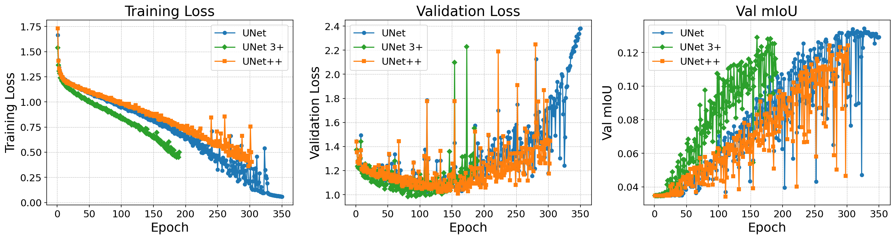

# UNets Topology Tradeoff for Semantic Segmentation

Compare **UNet**, **UNet++**, and **UNet 3+** through graph structure, finite-network kernel measurements, and semantic segmentation experiments on **Pascal VOC 2012**.

The repository contains the analysis pipeline and recorded experiments at network depths **3, 4, and 5**. It studies architecture behavior through three complementary views:

- **Structure:** DAG topology, path counts, effective depth, and effective width.
- **Numerical analysis:** pooled-feature and scalarized-gradient Gram spectra, output-curve speed, and curvature statistics.
- **Segmentation:** training dynamics, validation mIoU, pixel accuracy, and generalization gap.

The numerical analysis uses a `UNetDAG` surrogate; segmentation training uses the standalone models in `models/`. Their measurements should be interpreted with the [methodology and limitations](docs/methodology.md).

## Installation

Requirements: **Python 3.11+** and **pip**. The dataset is acquired separately. Full experiments are substantially more expensive than the small CPU sanity checks.

```bash
git clone https://github.com/Z-LI0403/unet-architecture-analysis.git
cd unet-architecture-analysis
python -m pip install -r requirements.txt
python main.py --help
```

Runtime dependencies and their versions are listed in `requirements.txt`. You can install them in a Python virtual environment of your choice. GPU availability depends on the installed PyTorch build and local hardware.

## Dataset

Prepare the Pascal VOC 2012 segmentation training and validation splits using the [official dataset instructions](http://host.robots.ox.ac.uk/pascal/VOC/voc2012/). The dataset root must contain:

```text
dataset/VOC2012/
├── JPEGImages/
├── SegmentationClass/
└── ImageSets/Segmentation/
    ├── train.txt
    └── val.txt
```

Use `--dataset_root /path/to/VOC2012` for experiments, or set `VOC2012_ROOT`. The loader accepts several nested VOC directory layouts; see `datasets.py`.

## Usage

### Sanity checks

Run deterministic checks on small graphs, analytically solvable kernel and curve examples, segmentation metrics, and forward/backward passes:

```bash
python tools/sanity_checks.py
```

These checks require no dataset. An additional end-to-end smoke script requires the dataset specifically under `dataset/VOC2012/`:

```bash
python smoke_test_end_to_end.py
```

### Architecture comparison

Run all three architectures at depth 5 with a nominal 5M parameter budget and three random seeds:

```bash
python main.py --dataset VOC2012 --arch all --depth 5 --param_budget 5M --seeds 42,123,2024 --output_dir experiments/reproduction_depth5
```

The example writes to a new directory, preserving the included results. Supported nominal budgets are `2M`, `5M`, `10M`, and `15M`; architecture/depth-specific channel widths are selected from the calibration table. Exact parameter counts can differ. Use depth `3` or `4` for other supplied configurations, and `--theoretical_only` to skip training.

See [experiment commands](docs/experiments.md) for theory-only runs, explicit width overrides, and inference. `main.py --help` lists all options.

### Visualization

Generate plots from saved experiment files:

```bash
python visualization.py --experiment depth=5 --output_dir reproduced_figures
python visualization.py --compare_depths --model UNet3Plus --output_dir reproduced_figures
```

`visualization.ipynb` provides an interactive version of the same plotting workflow.

## Recorded results



The included artifacts cover **9 architecture/depth combinations at seed 42**: nine empirical result files, six theoretical result files, and three theoretical failure reports. The three-seed command above is an example for new runs; it does not describe completed evidence in this repository.

Browse the [evidence index](evidence/README.md) for per-run availability and recorded validation metrics. Original numerical arrays, histories, and configurations are in `experiments/`; figures are in `figures/`. [Artifact checksums](evidence/artifact_checksums.json) verify the distributed evidence files.

Several configurations have `theoretical_only=true` while empirical results coexist. Their common execution provenance is unresolved. These artifacts have not been independently reproduced by a full training rerun. They support inspection of the recorded experiments, not a proven general architecture ranking or a causal explanation of segmentation performance.

## Repository structure

```text
├── requirements.txt         # Python runtime dependencies
├── main.py                  # Experiment and inference entry point
├── models/                  # Standalone segmentation architectures
├── unet_dag.py              # DAG surrogate and architecture definitions
├── dag_utils.py             # Graph structure and path metrics
├── theoretical_metrics.py   # Finite-network kernel and curve measurements
├── train.py                 # Training and segmentation evaluation
├── datasets.py              # VOC dataset loading
├── visualization.py         # Command-line plotting
├── visualization.ipynb      # Interactive plotting
├── tools/sanity_checks.py   # Dataset-free numerical sanity checks
├── experiments/             # Recorded metrics, configs, and failure reports
├── figures/                 # Recorded plots and ranking tables
├── evidence/                # Result inventory and artifact checksums
└── docs/                    # Commands, methodology, and research status
```

Dataset files, model checkpoints, environment folders, and machine-specific settings are excluded.

## References

The analysis workflow is based on Wuyang Chen, Wei Huang, and Zhangyang Wang, **[“No Free Lunch” in Neural Architectures? A Joint Analysis of Expressivity, Convergence, and Generalization](https://proceedings.mlr.press/v224/chen23a.html)**, AutoML 2023. See the [authors' reference implementation](https://github.com/chenwydj/no_free_lunch_architectures).

This repository adapts the workflow to UNet-family segmentation models. The reference implementation and paper PDF are linked rather than redistributed.

## License

No software license has been specified for this repository.
